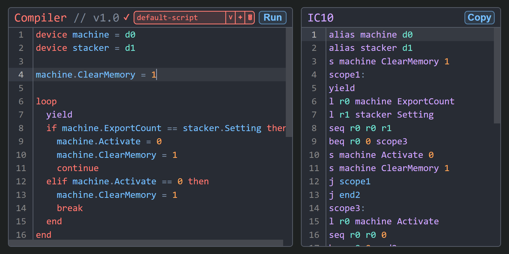

# High-Level Language for Stationeers IC10
This is a `high-level language` for `IC10` that is meant to be fully `backwards compatible` with the standard IC10 programming language. Any function written that is not recognized by the compiler will be converted into an IC10 instruction.

## Documentation
The top example is written in the high level code.
The bottom example is the compiled output in `IC10`.
### Table of Contents
- [Declaring Variables](#declaring-variables)
- [Using Variables](#using-variables)
- [Comments](#comments)
- [Arithmetic](#arithmetic)
- [Booleans](#booleans)
- [Labels and Jumps](#labels-and-jumps)
- [Loops](#loops)
- [If Statements](#if-statements)
- [Using Devices](#using-devices)
- [Using Definitions](#using-definitions)
- [Functions](#functions)
- [Using IC10 Functions/Variables in the High-Level Language](#using-ic10-functionsvariables-in-the-high-level-language)
- [Supported Operators](#supported-operators)

### Declaring Variables
`let` is currently just syntax sugar and only used to define variables without giving a value. There are no variable scopes at the moment. `numbers` are the only thing that can be assigned to variables.
```
let pi
let y = -2
pi = 3.14
```
```
move r11 -2
move r10 3.14
```
You can still technically use all the registers, but this may interfere with how variables are used by the compiler *(not recommended)*.
### Using Variables
Registers 10-15 are used for variables.
```
let x = 1
let y = x
```
```
move r10 1
move r11 r10
```
### Comments
```
# This is a comment
```
### Arithmetic
Click [here](#supported-operators) to see the list of all supported operators.
```
let x = 2 * 2
```
```
mul r10 2 2
```
### Booleans
```
x = true
y = false
```
```
move r10 1
move r11 0
```
### Labels and Jumps
Labels can be used with jumps just like in IC10.
The compiled output is the exact same.
```
top:
jal bottom
j top
bottom:
j ra
```
### Loops
```
loop
  yield # Pause for one game tick
end
```
```
scope1:
yield
j scope1
```
Break statements:
```
loop
  break
end
```
```
scope1:
j end1
j scope1
end1:
```
Continue statements:
```
loop
  continue
end
```
```
scope2:
j scope2
j scope2
```
### If Statements
A single if statement:
```
if true then
  yield
end
```
```
beq 1 0 end1
yield
end1:
```
If else statement:
```
if false then
  yield
else
  yield
end
```
```
beq 0 0 scope2
yield
j end1
scope2:
yield
end1:
```
If elif else statement:
```
if false then
  yield
elif true then
  yield
else
  yield
end
```
```
beq 0 0 scope2
yield
j end1
scope2:
beq 1 0 scope3
yield
j end1
scope3:
yield
end1:
```
### Using Devices
You can get/set device logic types using dot notation.
```
device pump = d0
pump.Setting = 1
x = pump.On
```
```
alias pump d0
s pump Setting 1
l r10 pump On
```
### Using Definitions
Definitions let you assign a number or a string to an identifier. A list of all aggregator functions (like Sum) can be found [here](#functions).
```
define light = StructureWallLight
define active = true
define y = 100
define logicType = "Setting"

# Count how many lights are on
x = Sum(light.On)

# Turn on all of your wall lights 
light.On = active

# Logic type based on definition
s(db, logicType, y)
```
```
define light HASH("StructureWallLight")
define active 1
define y 100
lb r10 light On Sum
sb light On active
s db Setting y
```
Reading from and writing to devices with specific names
```
define light = StructureWallLight

# Count how many lights are on inside
x = Sum(light.Inside.On)

# Turn on all the lights inside
light.Inside.On = true
```
```
define light HASH("StructureWallLight")
lbn r10 light HASH("Inside") On Sum
sbn light HASH("Inside") On 1
```
### Functions
Aggregator functions:
- Average, Sum, Minimum, Maximum
Everything else is converted directly into an IC10 instruction.
```
# Take the average of a logic type for a device group
x = Average(deviceHash.LogicType) # (deviceHash.logicType)
```
```
lb r10 HASH("deviceHash") LogicType Average
```
String parameters can be used to specify an IC10 variable.
loadSlot is unique in that the return value can be assigned to a variable.
```
# Load the quantity at slot 0 for device d0
y = loadSlot(d0, 0, "Quantity") # (device, slot index, logic type)
```
```
ls r10 d0 0 Quantity
```
Example using setSlot:
```
# Program a sorter
define iron = ItemIronIngot
define type = "PrefabHash"
setSlot(d0, 0, type, iron)
```
```
define iron HASH("ItemIronIngot")
ss d0 0 PrefabHash iron
```
### Using IC10 Functions/Variables in the High-Level Language
Since this high level language is fully backwards compatible with IC10, this means you can use functions and variables from the standard IC10 language directly inside your code! Functions are used in place of instructions. Just pass the parameters you would normally. You may be wondering how to write IC10 without using the registers. The solution is to just use the variable names and the compiler will substitute it with the register that it has been assigned.
```
x = DisplayMode.Seconds
top:
sleep(x)
j top
```
```
move r10 DisplayMode.Seconds
top:
sleep r10
j top
```
### Supported Operators
- Addition/Positive: `+`
- Subtraction/Negative: `-`
- Multiplication: `*`
- Division: `/`
- Or: `||`
- And: `&&`
- Greater than: `>`
- Less than: `<`
- Greater than or equal to: `>=`
- Less than or equal to: `<=`
- Equal to: `==`
- Not equal to: `!=`
- Not: `!`
- Parenthesis: `()`